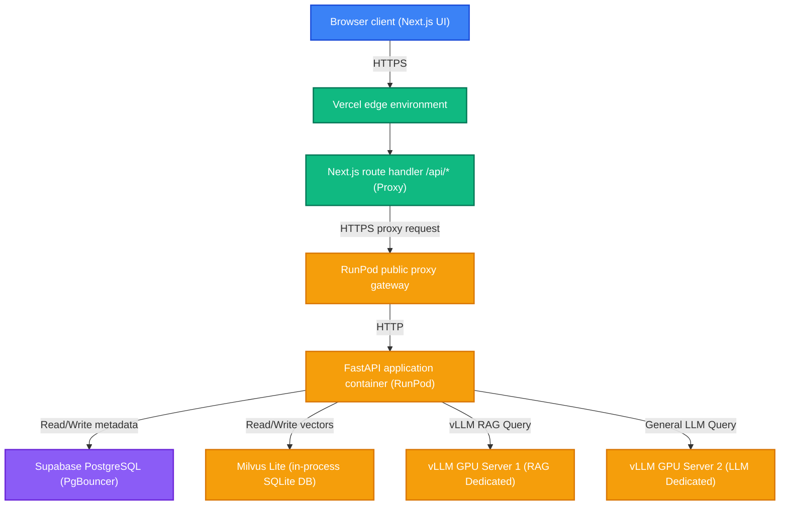
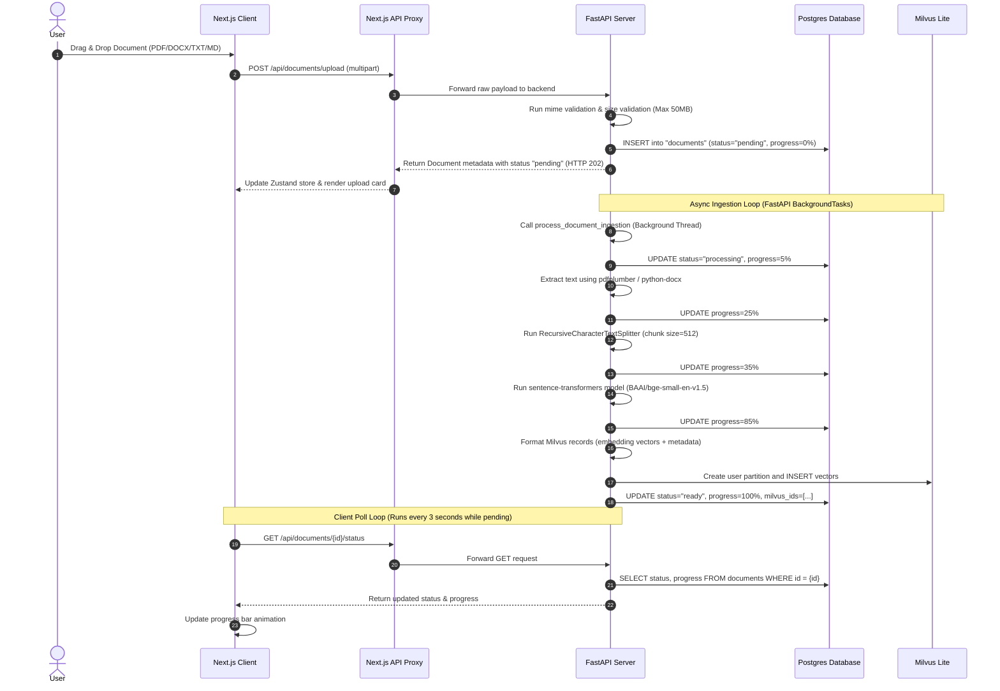
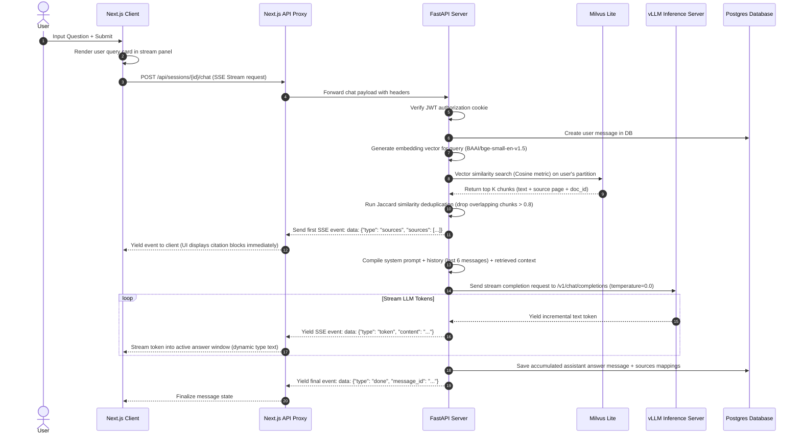
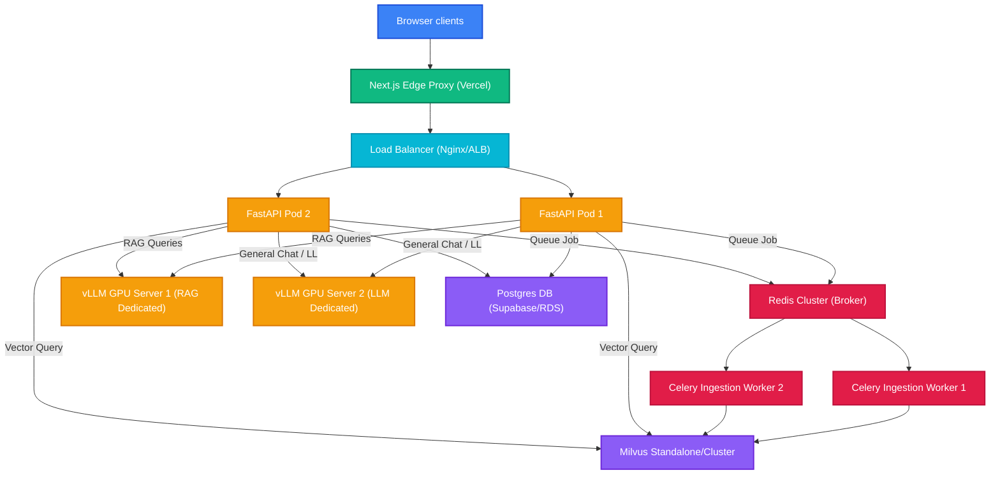

# RAG QA Engine: System Architecture & Code Review

This document provides a comprehensive system architecture blueprint and a detailed code review of the **RAG QA Engine** monorepo. It details the distributed components, database schemas, runtime interactions, and technical design patterns, and highlights key production recommendations.

---

## 1. High-Level System Architecture

The RAG QA Engine is built on a modern, decoupled, and containerized architecture. It is deployed as a hybrid serverless/GPU container stack:
* **Frontend**: Next.js App Router application hosted on **Vercel** with Next.js edge api routes proxying requests.
* **Backend Application Server**: FastAPI ASGI server running in a **RunPod** container stack (`rag-backend-stack`).
* **Vector Store**: **Milvus Lite** operating locally as an in-process file-based database (`./milvus.db`) inside the FastAPI container.
* **Inference Servers**: Dual dedicated GPU instances on **RunPod** running **vLLM OpenAI Servers**:
  * **vLLM Server 1 (RAG Dedicated)**: Optimised for processing document-contextualised queries.
  * **vLLM Server 2 (LLM Dedicated)**: Optimised for general, non-RAG chat / standard LLM serving.
* **Metadata Database**: Fully managed Serverless PostgreSQL hosted on **Supabase** (with transactional PgBouncer connection pooling).

### System Topology Diagram



---

## 2. Monorepo Structural Blueprint

The codebase is organized as a monorepo that encapsulates infrastructure definitions, deployment configurations, frontend, and backend assets:

```
newproj/
├── .gitignore              # Monorepo level git ignore exclusions
├── DEPLOYMENT.md           # Quick setup guides for local and production
├── README.md               # Architecture and repository summary
├── docker-compose.yml      # Local multi-container development orchestration
├── nginx/
│   └── nginx.conf          # Local Nginx configuration (reverse proxies api/ and /)
├── terraform/              # Infrastructure-as-Code files
│   ├── main.tf             # RunPod compute cluster and startup configurations
│   ├── variables.tf        # GPU sizing, disk limits, tokens, and system settings
│   └── outputs.tf          # Proxied endpoint endpoints and credentials
├── backend/
│   ├── Dockerfile          # RunPod workspace base setup config
│   ├── requirements.txt    # Vercel lightweight dependencies (auth, asyncpg, etc.)
│   ├── requirements-worker.txt # Complete dependency set for GPU containers (transformers, etc.)
│   └── app/
│       ├── main.py         # FastAPI ASGI server startup, lifespan hooks, and router setups
│       ├── config.py       # Pydantic Settings class loading configuration parameters
│       ├── database.py     # SQLAlchemy async engine & PgBouncer-compliant session factory
│       ├── core/           # Shared cross-cutting middleware & exceptions
│       │   ├── auth.py     # JWT encode/decode and password encryption utilities
│       │   ├── middleware.py # Structlog request logger and rate limiters
│       │   └── exceptions.py # Mapped custom HTTP exceptions
│       ├── milvus/         # Vector database drivers & schemas
│       │   ├── client.py   # Connection pooling and PyMilvus context managers
│       │   └── schema.py   # Collections layout (HNSW index, fields configuration)
│       ├── models/         # SQLAlchemy Declarative models (Postgres)
│       │   ├── user.py     # Email, username, password hashes
│       │   ├── document.py # Ingestion status, progress, size, and Milvus ID arrays
│       │   ├── session.py  # User chat sessions
│       │   └── message.py  # User questions and assistant responses with sources JSON
│       ├── routers/        # FastAPI Endpoint Controllers
│       │   ├── auth.py     # User registration, login, logout, profile checks
│       │   ├── sessions.py # Chat session creation, renaming, and retrieval
│       │   ├── chat.py     # Streaming SSE RAG chat endpoint
│       │   ├── documents.py# File uploads, polling, and deletion
│       │   └── health.py   # System diagnostic checks
│       └── services/       # Core business logic handlers
│           ├── ingestion.py# Document parsing, chunking, and embedding creation
│           ├── embedding.py# sentence-transformers models (BAAI/bge-small-en-v1.5)
│           ├── retrieval.py# Milvus vector query and Jaccard deduplication
│           ├── generation.py# System prompts compiler and vLLM token streamer
│           └── session_service.py # Database interactions helper
└── frontend/
    ├── package.json        # Next.js workspace configurations
    ├── next.config.ts      # Build targets and proxy settings
    ├── src/
    │   ├── middleware.ts   # Route protections and redirects
    │   ├── lib/
    │   │   ├── api.ts      # Axios wrapper for authenticated API requests
    │   │   └── types.ts    # Shared TypeScript Interfaces (Documents, Chats)
    │   ├── store/
    │   │   └── chatStore.ts# Zustand global state manager (active sessions, uploads)
    │   ├── hooks/
    │   │   └── useSSE.ts   # SSE network socket stream client
    │   ├── components/     # UI components
    │   │   ├── chat/       # ChatWindow, message lists, and citations panel
    │   │   └── documents/  # UploadZone and polling progress bars
    │   └── app/
    │       ├── layout.tsx  # Global fonts and styles wrapper
    │       ├── globals.css # Dark theme theme styles
    │       ├── (auth)/     # Registration and Login screens
    │       └── (app)/      # Authenticated routes (Library and Chat Sessions)
```

---

## 3. Dynamic Lifecycles & Data Flows

### A. Document Ingestion & Vector Indexing Lifecycle



### B. Retrieval Augmented Generation (RAG) Query Lifecycle



---

## 4. Database Schema Design

### A. Relational Metadata Database Schema (PostgreSQL)

The system utilizes an async SQLAlchemy mapper connected to Supabase PostgreSQL. On cascade deletes, child records (sessions, documents, and messages) are cleaned up automatically.

```
       ┌────────────────────────┐
       │         users          │
       ├────────────────────────┤
       │ id (UUID, PK)          │
       │ email (VARCHAR, UQ)    │
       │ username (VARCHAR, UQ) │
       │ hashed_pw (VARCHAR)    │
       │ is_active (BOOLEAN)    │
       │ created_at (TIMESTAMP) │
       └───────────┬────────────┘
                   │
         ┌─────────┴─────────┐
         │ (1-to-N Cascade)  │
         ▼                   ▼
┌──────────────────┐   ┌──────────────────────┐
│    documents     │   │       sessions       │
├──────────────────┤   ├──────────────────────┤
│ id (UUID, PK)    │   │ id (UUID, PK)        │
│ user_id (FK) ───►│   │ user_id (FK) ───────►│
│ filename         │   │ title (VARCHAR)      │
│ file_size (BIGINT│   │ created_at           │
│ updated_at       │   └──────────┬───────────┘
│ status (VARCHAR) │              │
│ progress (INT)   │              │ (1-to-N Cascade)
│ chunk_count      │              ▼
│ error_message    │   ┌──────────────────────┐
│ milvus_ids (JSON)│   │       messages       │
│ created_at       │   ├──────────────────────┤
│ updated_at       │   │ id (UUID, PK)        │
└──────────────────┘   │ session_id (FK) ────►│
                       │ role (VARCHAR)       │
                       │ content (TEXT)       │
                       │ sources (JSON)       │
                       │ token_count (INT)    │
                       │ created_at           │
                       └──────────────────────┘
```

### B. Vector Database Schema (Milvus Lite)

Milvus Lite manages dense vectors in a collection named `rag_chunks`. To ensure strong multitenancy security, partition namespaces are dynamically configured using the pattern `user_{user_uuid_cleaned}`.

* **Primary Key**: `id` (`INT64`, auto-increment)
* **Foreign Key**: `doc_id` (`VARCHAR(64)`) — links to the corresponding document UUID in PostgreSQL
* **Tenancy Field**: `user_id` (`VARCHAR(64)`) — ensures secure, isolated queries
* **Embedding Vector**: `embedding` (`FLOAT_VECTOR`, dimension=`384`) — vectors generated by `BAAI/bge-small-en-v1.5`
* **Text Chunk Content**: `text` (`VARCHAR(8192)`) — raw text snippet
* **Chunk Sequence Number**: `chunk_index` (`INT32`)
* **Source Tracking**: `source_page` (`INT32`) and `filename` (`VARCHAR(512)`)
* **Vector Index**: Type `HNSW`, metric type `COSINE`, search parameter configuration: `M=16`, `efConstruction=256`

---

## 5. Comprehensive Code Review

### Technical Strengths & Architectural Highlights

1. **PgBouncer prepared statements workaround**:
   * *Problem*: In serverless database topologies (like Supabase's transaction pooler), PgBouncer multiplexes database connections, which causes errors like `InvalidSQLStatementNameError` when python database drivers like `asyncpg` reuse named prepared statements.
   * *Resolution*: Solved by configuring `connect_args={"statement_cache_size": 0}` during SQLAlchemy engine setup in [database.py](backend/app/database.py). This disables client-side prepared statement cache name assignments and keeps queries compatible with poolers.
2. **Next.js decompression proxy recovery**:
   * *Problem*: Next.js serverless route handlers automatically decompress gzip payloads from upstream servers. Copying backend HTTP headers verbatim to client browser responses resulted in `gzip decoding failure` crashes.
   * *Resolution*: Implemented header filtering in [route.ts](frontend/src/app/api/[...path]/route.ts) that removes `content-encoding`, `content-length`, and `transfer-encoding` response headers.
3. **In-process Milvus Lite file lock mitigation**:
   * *Problem*: SQLite (which backs Milvus Lite under the hood) throws locking errors when multiple processes access the database file simultaneously (e.g. uvicorn web server and a separate Celery worker process).
   * *Resolution*: Moved all ingestion logic into FastAPI's in-process `BackgroundTasks` runner in [documents.py](backend/app/routers/documents.py). This guarantees that all reads and writes are managed inside the same Python process context.
4. **Timing-attack resistant login**:
   * *Problem*: Hackers can brute force user tables by analyzing how long it takes to process verification queries.
   * *Resolution*: Implemented timing-resistant authentication in [auth.py](backend/app/routers/auth.py) by verifying passwords against a pre-calculated dummy bcrypt hash if the requested user email is not found.
5. **Jaccard chunk deduplication**:
   * *Problem*: Large overlap windows in document chunking lead to redundant retrieval contexts, which wastes LLM prompt space.
   * *Resolution*: Added a Jaccard similarity post-processing filter in [retrieval.py](backend/app/services/retrieval.py) that drops overlapping chunks when the similarity score exceeds 0.8.

---

### Technical Debt & Recommendations for Scaling

While the current codebase is highly optimized for development, several components present architectural bottlenecks that should be addressed before deploying to high-volume production environments.

#### 1. Vector Database Bottlenecks
* **Current Implementation**: Milvus Lite storing vector configurations in a single file (`./milvus.db`) inside the FastAPI container.
* **Limitations**: 
  * If the FastAPI web server scales to multiple container instances, the local SQLite database file cannot be shared, leading to data inconsistency.
  * SQLite's read/write lock limits scaling throughput.
* **Recommendation**: Migrate to a dedicated **Milvus Standalone** or **Milvus Cluster** instance hosted on Kubernetes (as defined in `docker-compose.yml`), and update the environment variable to `MILVUS_HOST=milvus-standalone-address`.

#### 2. Background Task Reliability
* **Current Implementation**: FastAPI `BackgroundTasks` processes file ingestion asynchronously in-memory.
* **Limitations**: 
  * In-memory background queues are volatile. If the container restarts or experiences an OOM crash while a large document is indexing, the task is lost and the document stays stuck in `processing`.
  * Lacks built-in task retries, priority queues, or load balancing.
* **Recommendation**: Re-introduce a dedicated task queue system (such as **Celery** or **Arq** backed by **Redis**), but connect it to a standalone Milvus database instead of a local file to avoid SQLite file lock issues.

#### 3. Proxy-Layer Authentication checks
* **Current Implementation**: Next.js route handlers (`[...path]/route.ts`) act as transparent proxies, forwarding request payloads to FastAPI endpoints where JWT authentication is validated.
* **Limitations**: 
  * Unauthenticated requests are forwarded all the way to the backend, wasting compute cycles on invalid traffic.
* **Recommendation**: Implement token verification at the edge inside Next.js `middleware.ts`. This allows the proxy layer to reject unauthenticated requests immediately.

#### 4. Shared secrets and variables in compute configs
* **Current Implementation**: Database credentials and Hugging Face tokens are partially exposed in plaintext inside `main.tf` startup scripts and environment configs.
* **Limitations**: 
  * Increases the risk of credentials leaking.
* **Recommendation**: Inject secrets at runtime using a secure system like **AWS Secrets Manager** or **HashiCorp Vault**.

---

## 6. High Availability & Scaling Blueprint

To scale the monorepo into a highly available enterprise RAG system, implement the following architectural changes:



1. **Stateless Backend Nodes**: Scale FastAPI backend containers horizontally across multiple availability zones behind an Application Load Balancer.
2. **Distributed Ingestion Workers**: Scale dedicated Celery workers horizontally to handle high-volume document uploads. These workers parse, chunk, and embed documents asynchronously, and write vectors to a central Milvus cluster.
3. **Decoupled Dual LLM Engines**: Split vLLM compute loads into two dedicated channels:
   * **vLLM GPU Server 1 (RAG Dedicated)**: Configured with high GPU memory utilization limits and aggressive prefix caching. Enabling prefix caching is highly effective here since multiple queries reference the same chunked documents.
   * **vLLM GPU Server 2 (LLM Dedicated)**: Serving standard chat prompts without context injection, optimized for lower latency and standard conversation formats.
